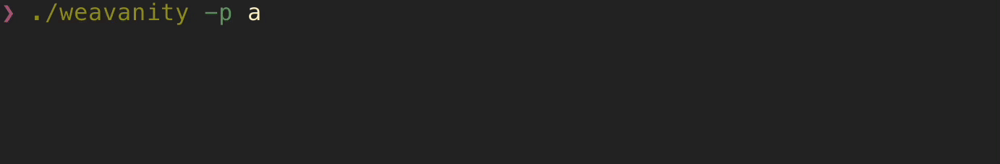

# Weavanity


## Usage

Currently `weavanity` is not packaged. You will need to have Dart >= 2 and compile it yourself with:
```sh
dart pub get # get dependencies
dart compile exe bin/weavanity.dart -o weavanity # compile
```

`weavanity` supports prefixes, suffixes, threads and help parameters. They are self explanatory. 

You should provide an `prefix` or `suffix` or both.

`threads` parameter will use the number of CPU cores of your machine as default.

```sh
Weavanity - An Arweave vanity address generator

Usage: weavanity [options]

Example: weavanity --prefix karl --suffix perm --threads 8

Options:
-p, --prefix     Desired prefix. Should be [a-zA-Z0-9_-]
-s, --suffix     Desired suffix. Should be [a-zA-Z0-9_-]
-t, --threads    number of threads
                 (defaults to "8")
-h, --help       Display help
```